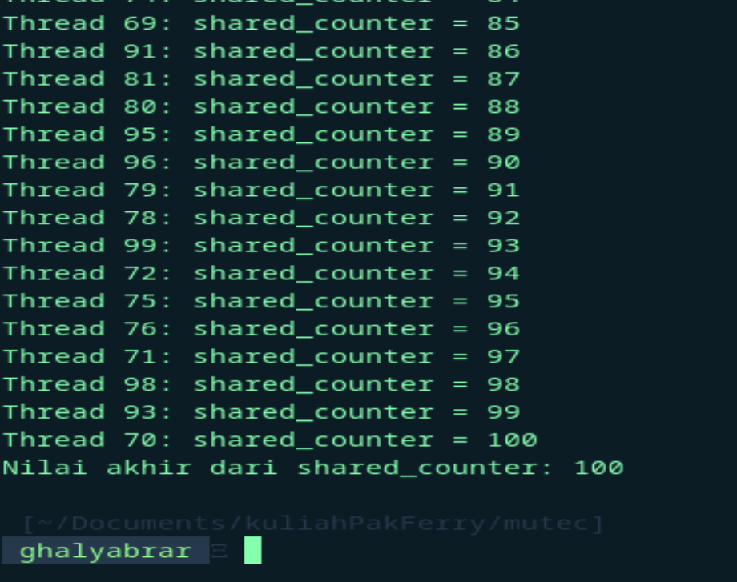

  <h1 class="text-align: center;font-weight: bold">Praktikum 11 Praktek System Operasi</h1>
  <h3 class="text-align: center;">Dosen Pengampu : Dr. Ferry Astika Saputra, S.T., M.Sc.</h3>

 

  
  

  <h3 style="text-align: center;">Disusun Oleh :</h3>
  

    <em>Muhammad Eko Nur Sholeh (3123500003)</em> 
    <em>Ghaly Abrarian Putra (3123500018)</em> 
    <em>Muhammad Rasyid Rafif (3122500030)</em>
  

<h3 style="text-align: center;line-height: 1.5">Politeknik Elektronika Negeri Surabaya Departemen Teknik Informatika Dan Komputer Program Studi Teknik Informatika 2023/2024</h3>
  

# Mutex (Analisa Soal 2)

## Program Tanpa Mutex

---

### Flowchart sederhana

### Output

### Analisa

Program ini menggunakan thread untuk memodifikasi variabel global `shared_counter` secara paralel, namun tidak menggunakan mekanisme penguncian seperti `mutex`, sehingga berpotensi menghadapi kondisi balapan (race condition). Dalam program ini, setiap thread menambah nilai `shared_counter` dan mencetak nilai saat ini tanpa memastikan bahwa akses ke variabel tersebut dilakukan secara eksklusif. Akibatnya, beberapa thread bisa mengakses dan mengubah `shared_counter` pada saat yang sama,

**Kesimpulannya** :

program ini mengilustrasikan pentingnya penggunaan mekanisme penguncian dalam pemrograman multithreaded untuk menjaga integritas data dan menghindari konflik akses yang dapat mengakibatkan hasil yang tidak diinginkan

## Program Dengan Mutex

---

### Flowchart sederhana

### Output

### Analisa

Program ini adalah program multithreading yang lebih aman dibandingkan dengan versi sebelumnya karena menggunakan mutex untuk menghindari race condition. Program ini membuat sejumlah thread dan setiap thread mengakses variabel global shared_counter dengan aman menggunakan mutex.

**Kesimpulannya** :

program ini menggunakan penguncian mutex yang memiliki manfaat sebagai penambah overhead terutama jika jumlah thread sangat besar untuk menjaga konsistensi data
