<div align="center">
  <h1 class="text-align: center;font-weight: bold">Praktikum 8<br>Praktek System Operasi</h1>
  <h3 class="text-align: center;">Dosen Pengampu : Dr. Ferry Astika Saputra, S.T., M.Sc.</h3>
</div>
<br />
<div align="center">
  
  <div align="center">
  <h3 style="text-align: center;">Disusun Oleh :</h3>
  <p style="text-align: center;">
    <em>Muhammad Eko Nur Sholeh (3123500003)</em><br>
    <em>Ghaly Abrarian Putra (3123500018)</em><br>
    <em>Muhammad Rasyid Rafif (3122500030)</em>
  </p>
</div>

<h3 style="text-align: center;line-height: 1.5">Politeknik Elektronika Negeri Surabaya<br>Departemen Teknik Informatika Dan Komputer<br>Program Studi Teknik Informatika<br>2023/2024</h3>
  <hr><hr>
</div>

## Bash Programming

### Apa itu bash?

Bash, kependekan dari Bourne Again Shell, adalah open source command line interpreter dan scripting language. Ini menafsirkan perintah yang dimasukkan pengguna, baik secara interaktif atau dari file skrip.

Ini berfungsi sebagai interface untuk memanggil perintah, memungkinkan system function calls.

Ada 2 tipe dari mode bash

- **Interactive Mode**
  Juga disebut sebagai command intepreter, memungkinkan eksekusi perintah di terminal. Ini mengeksekusi perintah secara berurutan jika ada beberapa perintah.

- **Non-interactive Mode**
  Ini merujuk pada scrpts, memungkinkan Anda menulis Bash syntax yang berisi rangkaian beberapa perintah untuk eksekusi skrip.

### Apa Perbedaan dari Bash dan Shell

Shell, an alias for Bourne Shell, adalah command-line interpreter untuk OS Unix dan Linux. Bash, alias Bourne Again Shell, adalah versi yang disempurnakan.

### Untuk apa skrip bash digunakan?

Skrip Bash memiliki banyak kasus penggunaan, termasuk:

- Menulis skrip untuk mengotomatiskan tugas pemrograman
- Menyinkronkan tugas untuk menyalin file
- Menjalankan tugas cron untuk penjadwalan

### Bagaimana cara menulis kode di bash?

Untuk menulis kode dalam skrip Bash, ikuti langkah-langkah berikut:

- Di terminal, buat file menggunakan `vi test.sh`.
- Tambahkan `#!/bin/bash` di bagian atas file.
- Tambahkan beberapa cuplikan kode shell.
- Simpan file shell dengan `.sh` ekstensi.
- Jalankan skrip shell menggunakan `./test.sh` perintah di terminal.

### Apakah bash termasuk bahasa pengkodean?

Bash menjalankan perintah dari terminal atau file. Ini adalah bahasa pemrograman yang beroperasi pada sistem operasi kernel Unix/Linux, berisi semua fitur untuk menulis kode lengkap.

Bash adalah tipe shell khusus yang menerima masukan dari perintah, menjalankan kode, dan memproses masukan, serta mengembalikan hasilnya.

### Jenis Shell

Ada berbagai jenis shell di OS Unix.

<table>
<thead>
<tr>
  <th style="background-color: blue; color: white">Tipe Cangkang</th>
  <th style="background-color: blue; color: white">Alias</th>
  <th style="background-color: blue; color: white">Garis Pertama</th>
<tr>
</thead>
<tbody>
  <tr>
  <td>SH</td>
  <td>Bourne Shell</td>
  <td>#!/bin/sh</td>
  </tr>
   <tr>
  <td>bash</td>
  <td>Bourne Again Shell</td>
  <td>#!/bin/bash</td>
  </tr>
   <tr>
  <td>cshell</td>
  <td>C shel</td>
  <td>#!/bin/csh</td>
  </tr>
</tbody>
</table>

| tcsh | TENEX C shell | #!/bin/tcsh | | | | ksh | Korn shell | #!/bin/ksh |

### Perbedaan dari Command Line dan Script di bash

Mari kita lihat perbedaan antara baris perintah dan skrip

Opsi baris perintah

- Baris perintah memiliki prompt yang menerima masukan dari pengguna
- Perintah tidak disimpan ke file.
- Ini hanya mendukung satu perintah pada satu waktu.

File skrip

- Mendukung banyak perintah dalam satu file
- Prompt masih dapat ditulis dalam file skrip
- Hanya satu baris dalam sebuah file yang dijalankan secara berurutan

## Bash - Variables

**Deklarasi Variable**: Untuk membuat variable, maka harus memberikan nilai padanya

```
variableName=VariableValue
```

Keterangan:

- variableName: dapat berisi kombinasi huruf apa saja, angka, dan garis bawah
- variableValue: adalah nilai yang disimpan dalam variabel, dan dapat berupa angka, string atau boolean. Simbol `=` digunakan untuk memberikan nilai pada suatu variabel.

Misalnya

```
AGE=25
```

### Cara mengakses variabel di bash

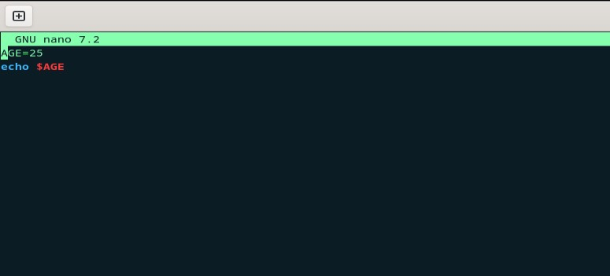

Pertama, deklarasikan variabel _AGE_ dan beri nilai 25. Kemudian, gunakan `echo` untuk menampilkan outputnya. Simbol dolar `$` sebelum nama variabel sangat penting untuk mengakses nilainya.

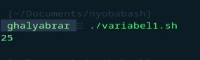

### Bash Shell readonly variables

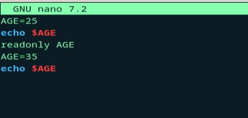

Setelah variabel diberi nilai, kita dapat mengubahnya menjadi nilai baru menggunakan operator penugasan =.

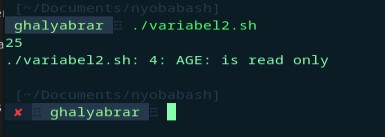

### Bash Unset Variable

Keyword `unset` membantu menghapus nilai dari variabel yang ditentukan. Variabel tetap dapat diakses tetapi akan mencetak nilai kosong.

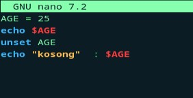

Output:

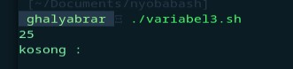

### Variables Scope

Setiap variabel yang dideklarasikan harus memiliki cakupan, yang menentukan di mana variabel tersebut dapat digunakan dalam program.

Misalnya, jika suatu variabel dideklarasikan di dalam suatu fungsi, maka variabel tersebut hanya tersedia di dalam fungsi tersebut dan tidak dapat diakses di luar fungsi tersebut.

Dalam Bash, cakupan variabel dapat didefinisikan dengan dua cara:

- Variabel global: Variabel yang dideklarasikan di luar fungsi atau blok kode khusus dan dapat diakses dari seluruh bagian skrip.
- Variabel lokal: Variabel yang dideklarasikan di dalam fungsi atau blok kode khusus dan hanya dapat diakses di dalam fungsi atau blok tersebut.

Terkadang kita ingin membaca konten file menggunakan bash programming.
Ada berbagai macam cara yang dapat kita lakukan

### Bagaimana cara membaca file demi baris di bash Shell?

- menggunakan perulangan while

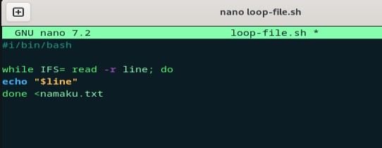

Output

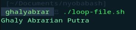

Output diatas merupakan isi dari file `loop-file.txt`

## Bash - Comments

Posting ini menjelaskan cara menulis komentar dalam skrip bash shell, disertai dengan contoh.

Komentar dalam skrip bash shell adalah pernyataan kode yang berisi teks yang bisa dibaca oleh pengguna, namun dilewati oleh shell saat eksekusi. Setiap bahasa pemrograman memiliki fitur komentar, yang memberikan deskripsi pada baris kode atau pernyataan.

Komentar satu baris dalam kode membantu pengembang dalam mengedit dan memahami kode dengan lebih baik.

Bahasa skrip bash memungkinkan penggunaan dua jenis komentar:

- **Komentar satu baris**
- **Komentar multi-baris**

Komentar bermanfaat bagi manusia, karena kode ditulis untuk scripting.

### Komentar satu baris di bash shell

Komentar satu baris dalam skrip shell dilambangkan dengan simbol `#` di awal setiap baris.

Komentar ini mengandung string yang memberikan informasi tentang baris kode terkait dalam skrip shell.

Penting untuk menempatkan komentar satu baris pada baris terpisah untuk kejelasan.

Untuk menulis komentar satu baris, gunakan simbol `#` di awal komentar. Komentar satu baris selalu dimulai dengan simbol `#`.

**Syntax:**

```
# Single-line comments
```

Spasi kosong setelah `#` simbol tidak diperlukan. Berikut ini adalah contoh komentar satu baris dalam skrip shell.

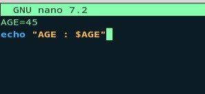

Output

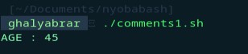

### Komentar multi-baris dalam skrip shell

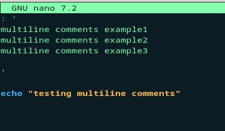

Output:

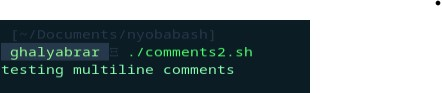

### Kesimpulan

Singkatnya, kita telah mempelajari cara menambahkan komentar satu baris dan multi-baris dalam pemrograman skrip shell.

## Bash - Arrays

Array dalam shell adalah variabel yang memungkinkan Anda menyimpan lebih dari satu nilai atau data dalam satu variabel. Misalnya, jika Anda memiliki daftar bilangan bulat dari 1 hingga 100, Anda dapat menggunakan array untuk menyimpannya dalam skrip shell, yang akan menghindari kebutuhan untuk mendeklarasikan setiap nilai secara terpisah dengan pernyataan seperti `let number1=1`, dan seterusnya. Dengan menggunakan array, Anda dapat merujuk ke satu variabel dan menyimpan semua nilai tersebut di dalamnya.

### Bagaimana cara mendeklarasikan dan membuat array?

Ada dua jenis array yang dapat kita buat:

- Array yang diindeks: Elemen array disimpan dengan indeks mulai dari nol.
- Array terkait: Array disimpan dengan pasangan nilai kunci.

**Deklarasi sebuah array**

Untuk membuat array, kita perlu mendeklarasikan array.

```
declares -a array; # indexed array
declare -A array; # associative array
```

Sebuah array dideklarasikan dengan kata kunci declaredengan opsi `-a` atau `A`

**Menetapkan nilai tanpa mendeklarasikan Array**

```
arrayvariable[index]=value
```

Artinya, `arrayvariable[indeks]` array dideklarasikan dan diberi nilai.

Array yang diindeks dimulai dari nol dengan panjang array - 1. Indeks 0 mengembalikan elemen pertama, sedangkan indeks -1 mengembalikan elemen terakhir.

Array bisa berisi angka, string, atau campurannya. Mari kita buat contoh array.

### Akses nilai Array

Array berisi indeks untuk mendapatkan elemen. Elemen array dapat diakses menggunakan sintaks di bawah ini.

```
${array_name[index]}
```

### Deklarasi Array angka dan Loop

Array dapat berisi angka Contoh ini berisi array angka dan loop for untuk dicetak

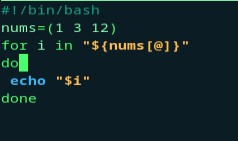

Output:

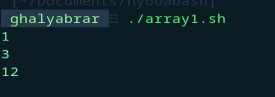

### Deklarasi Array string dan Loop

Array dapat berisi angka Contoh ini berisi array angka dan loop for untuk dicetak

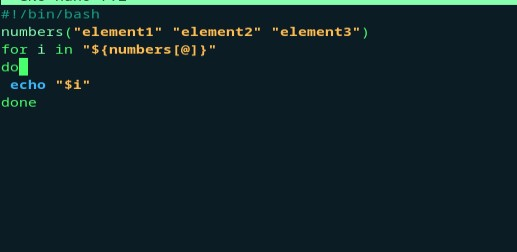

Output:

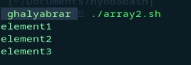

### Akses elemen pertama array

Dalam array, indeks elemen pertama adalah nol, sehingga `array[0]` mengembalikan elemen pertama.

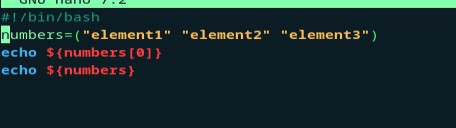

Output:

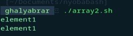
