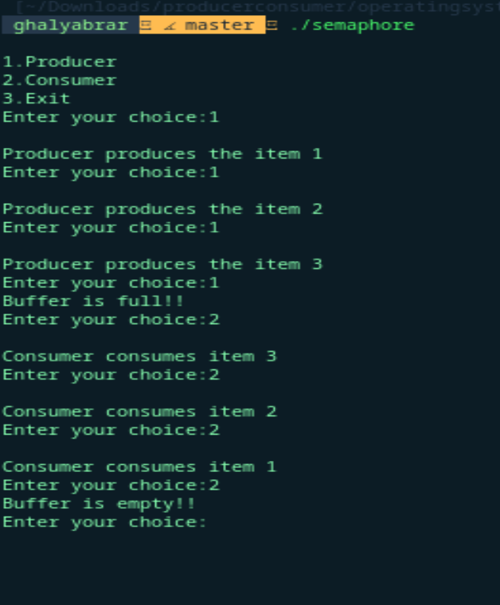
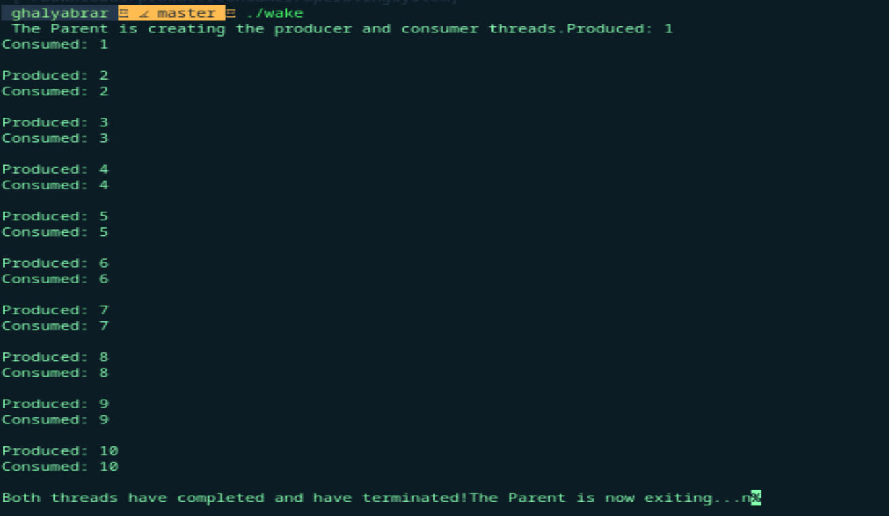

  <h1 class="text-align: center;font-weight: bold">Praktikum 9 Praktek System Operasi</h1>
  <h3 class="text-align: center;">Dosen Pengampu : Dr. Ferry Astika Saputra, S.T., M.Sc.</h3>

 

  
  

  <h3 style="text-align: center;">Disusun Oleh :</h3>
  

    <em>Muhammad Eko Nur Sholeh (3123500003)</em> 
    <em>Ghaly Abrarian Putra (3123500018)</em> 
    <em>Muhammad Rasyid Rafif (3122500030)</em>
  

<h3 style="text-align: center;line-height: 1.5">Politeknik Elektronika Negeri Surabaya Departemen Teknik Informatika Dan Komputer Program Studi Teknik Informatika 2023/2024</h3>
  

## Producer Consumer Semaphore

Analisa:
Program di atas adalah contoh implementasi dari masalah Produsen Konsumen dengan Semaphore dalam bahasa C. Dalam skenario ini, terdapat tiga menu dalam program: pertama, Produsen; kedua, Konsumen; dan ketiga, Keluar. Menu Produsen pertama kali adalah untuk membuat data dengan maksimal data sebanyak 3. Jika pengguna memilih opsi 1 berturut-turut lebih dari 3 kali, maka akan mencetak pesan "Buffer penuh!!" yang mengindikasikan bahwa buffer penyimpanan sudah penuh. Begitu juga sebaliknya, jika pengguna memilih menu kedua secara berturut-turut lebih dari 3 kali, maka akan mencetak pesan "Buffer kosong!!" yang menandakan bahwa buffer sudah kosong/tidak memiliki isi. Menu ketiga adalah untuk keluar dari program.

## Producer Consumer Wake-Sleep thread

Analisa :

Program di atas adalah contoh implementasi dari masalah Produsen Konsumen dengan Semaphore menggunakan thread dalam bahasa C++. Dalam kasus ini, program menggunakan thread untuk menjalankan produsen dan konsumen secara bersamaan. Dengan menggunakan mekanisme seperti kunci gembok (mutex) dan lampu lalu lintas (variabel kondisi), program memastikan bahwa hanya satu proses yang dapat mengakses sumber daya pada satu waktu. Ketika produsen menghasilkan barang, ia memberitahu konsumen dengan mengirim sinyal bahwa barang baru tersedia. Begitu juga, ketika konsumen mengonsumsi barang, ia memberi tahu produsen dengan mengirim sinyal bahwa barang tersebut telah diambil. Dengan demikian, program memastikan bahwa proses produksi dan konsumsi berjalan dengan aman dan terkoordinasi.

### Referensi

- [Producer Consumer Problem](https://www.geeksforgeeks.org/producer-consumer-problem-in-c/)
